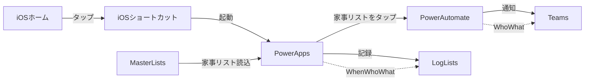

# 家事実行ログアプリを作ってみた
## WHAT
いつ、だれが、なんの家事を行ったのかを記録し、通知するアプリです。

PowerAppsのアプリから操作して、PowerAutomateで設定した自動化フローを経てTeamsで通知する動きをします。

## WHY
毎日行う家事は忘れにくいですが、

数日に一回行うような家事は、前回いつ実行したかを忘れてしまうものです。

特に二人暮らし・共働きの我が家では「お風呂掃除、いつやったっけ？」という話題が頻繁にありました。

このアプリから記録することで、「いつやったか」問題をTeamsの通知を見て解決できるような仕組みを作りたいと思いました。

## HOW
### ■ 基本設計

PowerAutomateを使う必要があることは明らかでしたので、まずはツールの連携図を書いてみました。

PowerAutomateのアプリにあるボタン機能を使用したらこれほどツールを使わずにTeams通知ができるのですが、

家事というただでさえめんどくさいものを行った後に記録というアクションを追加しなければならないので、

できるだけ普段からアクセスしやすい媒体で、少ないアクションで求める文面の通知ができることに重点を置きました。

そもそもPowerAutomateのできることが多すぎて、私のような非エンジニアには理解が難しすぎるアクションが多かったことから、違う形で実装したいと考えていました。

iPhoneのショートカットアプリを使用したらPowerAppsのアプリへワンタップでアクセスできることがわかり、理想的な動線であったので

今回はPowerAppsで作成することにしました。

### ■ 結果
最初に、どのようなアプリを作成できたかをお見せします。

1. 操作画面から実行した家事の名前をタップします。

2. いつ、だれが、なにをしたかが記録され、確認のポップアップが表示されます。

3. OKをタップすると、Teamsに通知が飛びます。

### ■ 実装
書き出しのために箇条書きで記録します。

ゆくゆくは読み物となるように編集する予定です。

* PowerApps
  * 画面構造
    * トップページ
      * ポップアップグループ
        * 役割
          * when変数、who変数、what変数を表示する
          * Cancelを押したら変数をクリアにしてポップアップを消す
          * OKを押したらログ用Listsにデータを登録して確定ページへ移動、PowerAutomateを実行、さらにポップアップを消す
      * ギャラリーグループ
        * 役割
          * マスターListsの項目を表示する
          * 項目を押したら変数にデータを登録する
            * when：現在の日付を登録
            * who：操作しているユーザー名を登録
            * what：項目名を登録
      * ヘッダーグループ
        * 見栄え重視
        * ヘッダー背景とタイトルをグループに
    * 確定ページ
      * ヘッダーグループ
        * トップページのヘッダーと同じものを表示
      * 完了マークと「登録しました」のメッセージを表示
      * 3秒後に自動でトップページへ戻る
* Lists
  * マスターLists
    * 1列目
      * 家事名＝リストで表示する項目名
  * ログ用Lists
    * 1列目
      * when：家事を実行した日付
    * 2列目
      * who：家事を実行した人＝アプリを操作した人
    * 3列目
      * what：実行した家事名＝アプリでタップした項目名
* PowerAutomate
  * トリガー
    * PowerApps
  * アクション
    * when変数、who変数、what変数を初期化する
    * Teamsのallタグのメンショントークンを取得
    * 指定のチャネルにメッセージを投稿する

